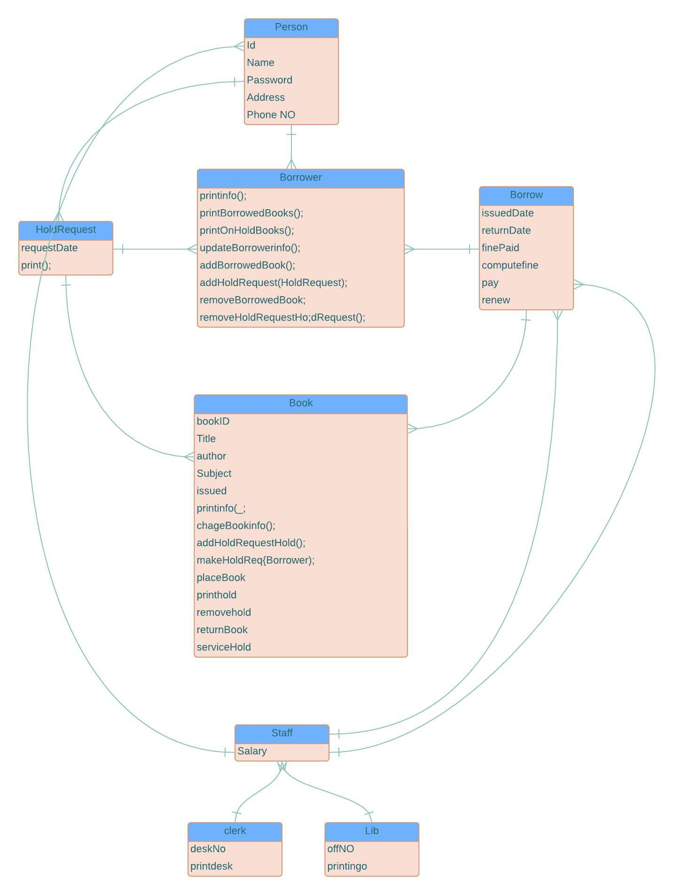
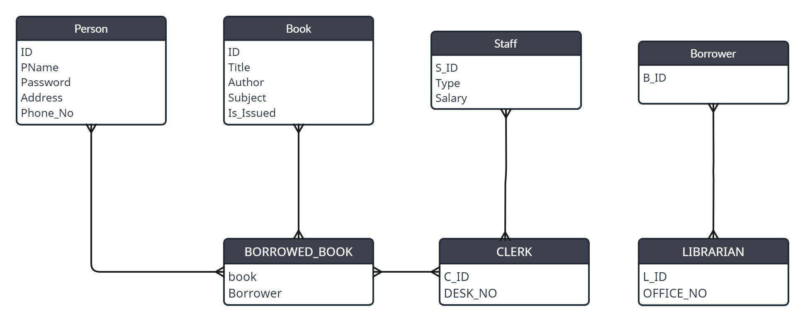

# Libzazy Book Management System - Java

Welcome to Libzazy Book Management System! This Java-based project is designed to revolutionize how libraries manage their resources efficiently. Whether you're an avid reader or a librarian, Libzazy simplifies the process of book management, making it both intuitive and effective.

## Features That Shine ✨

### User Interface

Libzazy boasts a sleek console-based user interface that strikes the perfect balance between simplicity and functionality. Say goodbye to clunky interfaces and hello to smooth interactions!

### User Functions

- **Secure Login:** Dive into your account with confidence, knowing your data is protected.
- **Search Like a Pro:** Find your next favorite read by title, author, genre, or any other criteria you fancy.
- **Book Details at Your Fingertips:** Get all the juicy details about a book, from availability to location, in a snap.
- **Borrowing Made Easy:** Check out and return books hassle-free, keeping your reading adventures on track.

### Administrative Superpowers

- **Admin Access:** Administrators wield the power of the system with secure logins and privileged access.
- **Expand Your Library:** Add new books effortlessly, enriching your library's catalog with ease.
- **User Management:** Keep your user base in check by adding, modifying, and handling user-related tasks seamlessly.
- **Borrowing Insights:** Dive into the borrowing history to track and manage issued books effectively.
- **Library Overview:** Get a bird's eye view of all available books and their status within the library.

### Secure Logging Out

Ensure data privacy and system security with the ability to log out securely, putting your mind at ease.

## Getting Started in Style 🚀

To embark on your Libzazy journey, follow these steps:

1. Clone the repository like a pro:

   ```
   git clone https://github.com/your-username/Book-Management-System-JAVA.git
   ```

2. Navigate to the project directory:

   ```
   cd Book-Management-System-JAVA
   ```

3. Compile those Java files:

   ```
   javac *.java
   ```

4. Launch the main Java file:

   ```
   java Main
   ```

5. Let the prompts on the console guide you through the magic of Libzazy.

## Visualize Your Success 📊

### Class Diagram

Behold the class diagram of Libzazy depicted below:



### Database Schema

Peek into the database schema of Libzazy depicted below:



**Note:** After refactoring, the new `HoldRequestOperations` class has been introduced to enhance modularity and maintainability. Check out the [Refactoring Details](#refactoring-details) section below for more info.

## Refactoring Marvels 💡

With the addition of the `HoldRequestOperations` class, bidirectional dependencies between `HoldRequest` and `Book` classes are a thing of the past. This refactor elevates the system's modularity and maintainability to new heights.

## Join the Adventure 🌟

We welcome contributions of all shapes and sizes! Whether you have suggestions, improvements, or bug fixes, share your brilliance by opening an issue or submitting a pull request on GitHub.

## License to Thrill 📜

This project operates under the [MIT License](LICENSE), granting you the freedom to explore, innovate, and thrive.

---

Got questions or need a guiding hand? Don't hesitate to reach out. Happy managing your books with Libzazy! 📚🖥️
